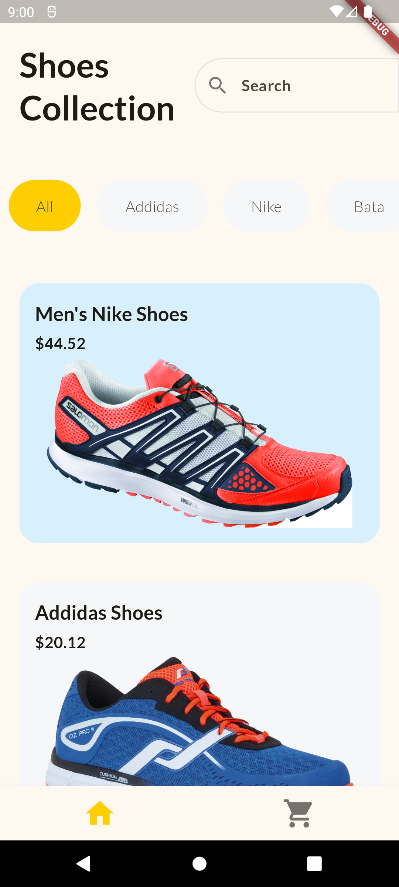
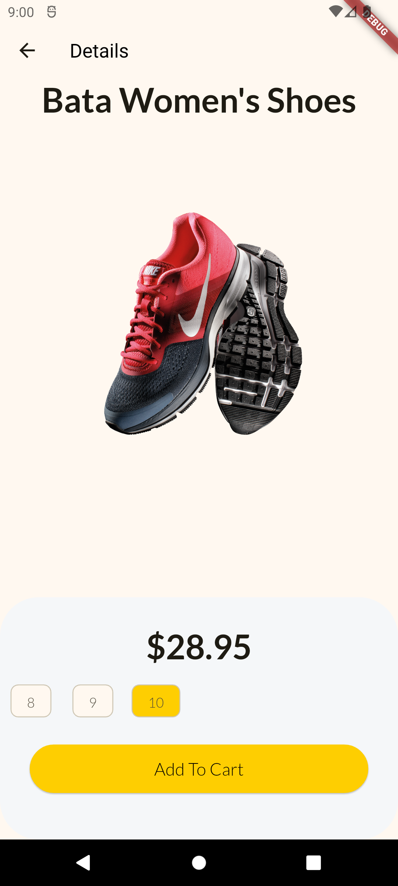
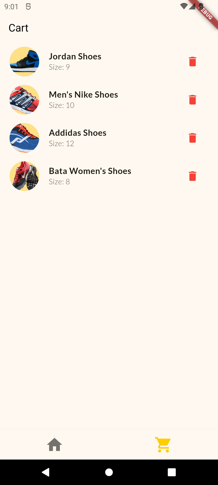

# Flutter Shopping App

This is a simple shopping app built with Flutter. It showcases product listings, allows users to view product details, add items to their cart, and manage the cart.

## Features
- Browse through a collection of shoes from various brands.
- View product details such as price, image, and available sizes.
- Add products to the shopping cart and remove them.
- Responsive design: The app works on both mobile and tablet-sized screens.

## Screenshots

### 1. Product List Page



### 2. Product Details Page



### 3. Cart Page



## Tech Stack

- Flutter
- Provider (for state management)

## Getting Started

To run this project locally, follow these steps:

### Prerequisites
- Flutter SDK installed. You can get it from [flutter.dev](https://flutter.dev/docs/get-started/install).
- An editor like VS Code or Android Studio.

### Installation

1. Clone the repository:
    ```bash
    git clone https://github.com/your-username/flutter-shopping-app.git
    ```

2. Navigate to the project directory:
    ```bash
    cd flutter-shopping-app
    ```

3. Install dependencies:
    ```bash
    flutter pub get
    ```

4. Run the app:
    ```bash
    flutter run
    ```